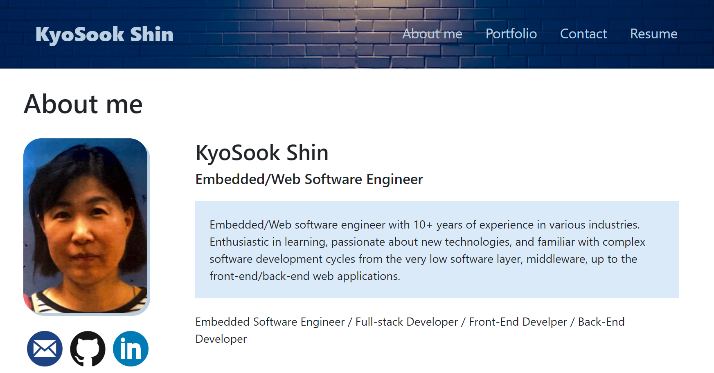
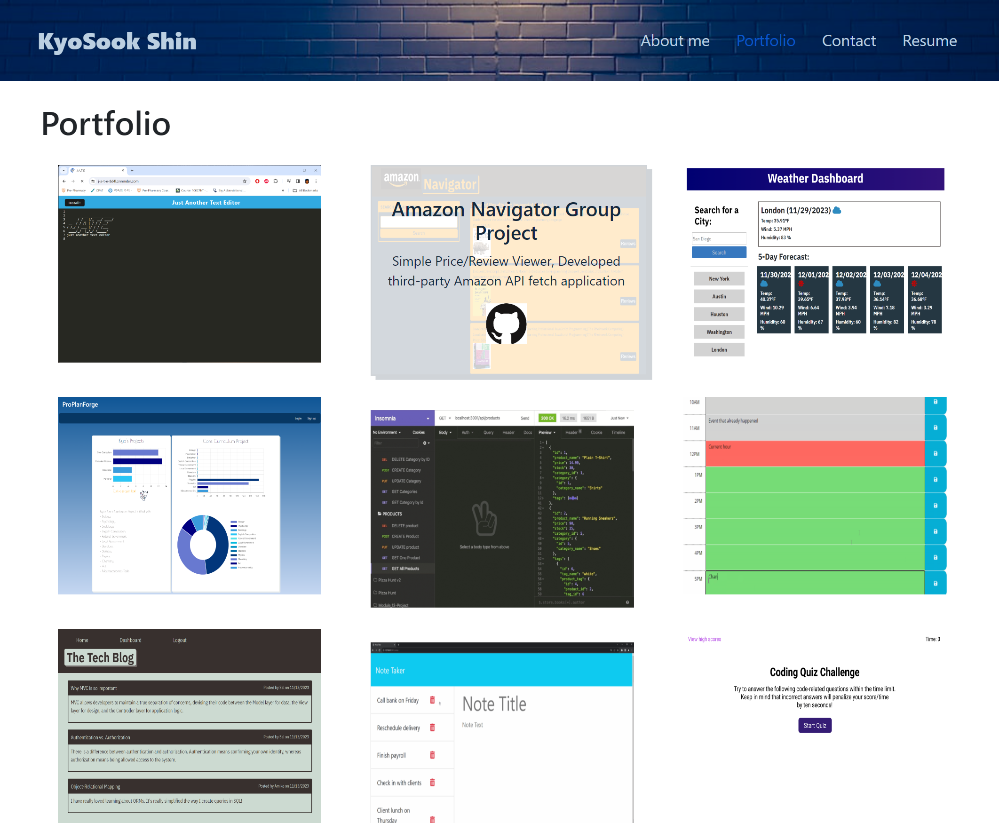
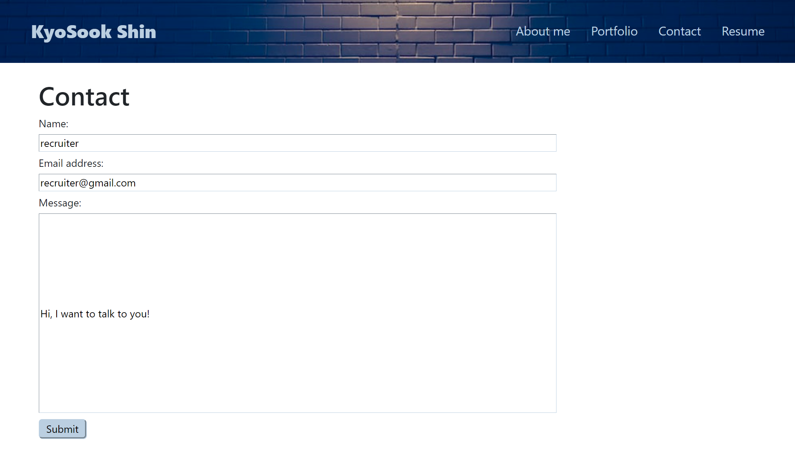
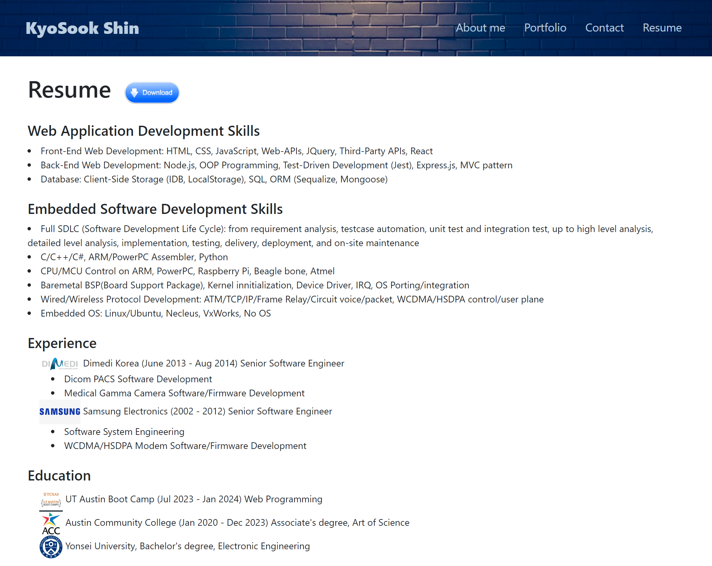

# ReactPortfolio  

## Description

This program provides a single-page application to view the deployed React portfolio of work samples.

## Features

GIVEN a single-page application portfolio for a web developer

* WHEN you load the portfolio, THEN you are presented with a page containing a header, a section for content, and a footer

* WHEN you view the header, THEN you are presented with the developer's name and navigation with titles corresponding to different sections of the portfolio

* WHEN you view the navigation titles, THEN you are presented with the titles About me, Portfolio, Contact, and Resume, and the title corresponding to the current section is highlighted.

* WHEN you click on a navigation title, THEN you are presented with the corresponding section below the navigation without the page reloading and that title is highlighted

* WHEN you load the portfolio the first time, THEN the About Me title and section are selected by default.

* WHEN you are presented with the About Me section, THEN you see a recent photo or avatar of the developer and a short bio about them

* When you are presented with the Portfolio section, THEN you see titled images of six of the developer's applications with links to both the deployed applications and the corresponding GitHub repository

* When you are presented with the Contact section, THEN you see a contact form with fields for a name, an email address, and a message 

* WHEN you move your cursor out of one of the form fields without entering text, THEN you receive a notification that this field is required.

* When you enter text into the email address field, THEN you receive a notification if you have entered an invalid email address

* When you are presented with the Resume section, THEN you see a link to a downloadable resume and a list of the developer's proficiencies 

* When you view the footer, THEN you are presented with text or icon links to the developer's GitHub and LinkedIn profiles, and their profile on a third platform (Stack Overflow, Twitter)

## Installation on your local machine
After downloading from GitHub, you can run this program on your local machine by following the procedure below:
1. From a terminal, run `npm install` to install necessary packages.
2. Run `npm run start` to run vite server on your `localhost:3000`. 
3. Open a brower and goto `localhost:3000` url.
4. You can run ReactPortfolio on your local machine.

## Technologies used
1. react (https://react.dev/)
2. react-dom (https://legacy.reactjs.org/docs/react-dom.html)
3. react-router-dom (https://reactrouter.com/en/main)
4. bootstrap (https://getbootstrap.com/) 
5. vite (https://vitejs.dev/)

## Source Code References
  This project has used some reference codes from the following sites

   * https://git.bootcampcontent.com/University-of-Texas-at-Austin/UTA-VIRT-FSF-PT-07-2023-U-LOLC.git   

## Contact
  * Author: Kyosook Shin
  * Author's Email: kyosook.shin@gmail.com  
  * GitHub: https://github.com/alla0810/ReactPortfolio
  * Deployed: https://portfolio-kyosook.netlify.app

## Screenshot  

  

  
  

